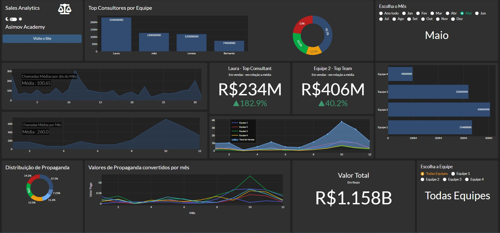

  <b>Sales Analysis Dash</>

## 💻 Projeto

Dashboard para análise de métricas e vendas de um call center feito com Python.

## 🔧 Funções

- Ler e dispor dados de forma visual das minuciosidades do dataset
- Filtrar por equipe e/ou mês os dados para uma análise mais precisa e específica
- Possibilidade de alternar entre o tema claro e escuro do layout

## 👨‍💻 Tecnologias Utilizadas

Utilizando apenas **PYTHON** e as bibliotecas:

> - Dash
> - Dash-Core-Components
> - Dash HTML
> - Dash Bootstrap
> - Plotly
> - Pandas

pip install wheel
pip install pandas
pip install dash
pip install dash_bootstrap_components
pip install app
pip install dash_bootstrap_templates

---

Feito by CainanNeves

